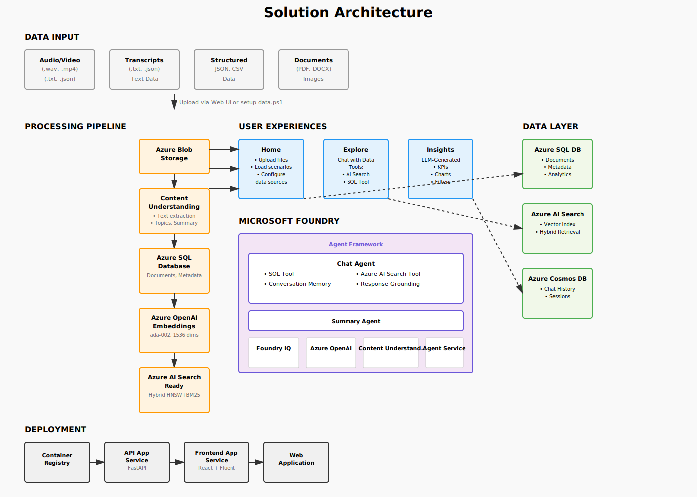
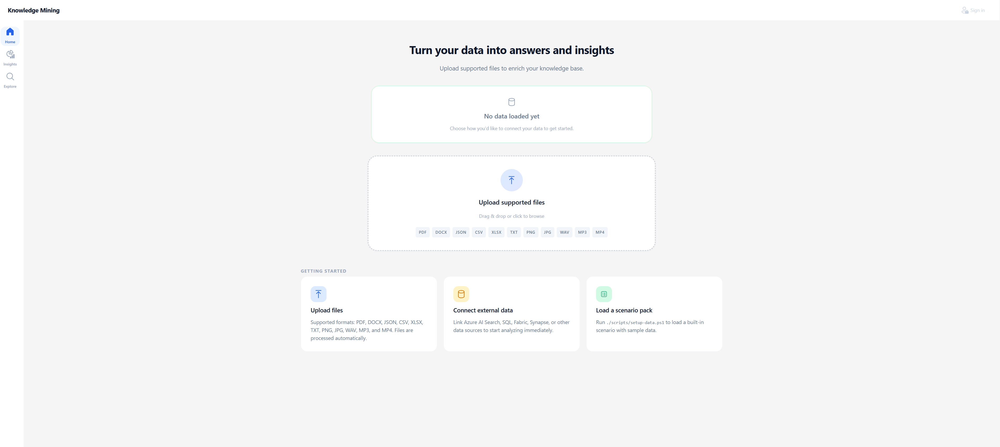

# Conversation knowledge mining solution accelerator

Gain actionable insights from large volumes of conversational data by identifying key themes, patterns, and relationships. Using Microsoft Foundry, Azure Content Understanding, Azure OpenAI Service, and Foundry IQ, this solution analyzes unstructured dialogue and maps it to meaningful, structured insights.

Capabilities such as topic modeling, key phrase extraction, speech-to-text transcription, and interactive chat enable users to explore data naturally and make faster, more informed decisions.

Analysts working with large volumes of conversational data can use this solution to extract insights through natural language interaction. It supports tasks like identifying customer support trends, improving contact center quality, and uncovering operational intelligence — enabling teams to spot patterns, act on feedback, and make informed decisions faster.

<br/>

<div align="center">

[**SOLUTION OVERVIEW**](#solution-overview)  |  [**ARCHITECTURE**](#solution-architecture)  |  [**QUICK DEPLOY**](#quick-deploy)  |  [**SCENARIO PACKS**](#scenario-packs)  |  [**BUSINESS SCENARIO**](#business-scenario)  |  [**SUPPORTING DOCUMENTATION**](#supporting-documentation)

</div>

<br/>

> **Note:** With any AI solutions you create using these templates, you are responsible for assessing all associated risks and for complying with all applicable laws and safety standards. Learn more in the transparency documents for [Agent Service](https://learn.microsoft.com/en-us/azure/ai-foundry/responsible-ai/agents/transparency-note) and [Agent Framework](https://github.com/microsoft/agent-framework/blob/main/TRANSPARENCY_FAQ.md).

<br/>

---

## Solution Overview

This solution turns any conversational or enterprise dataset into an interactive, insight-driven experience. Files are uploaded or connected, processed through an AI extraction pipeline, and made explorable through three integrated surfaces: **Home** (upload and manage data), **Explore** (chat with your data using a Foundry-hosted agent), and **Insights** (auto-generated KPI dashboards driven by LLM schema analysis).

The platform is fully scenario-agnostic. The same deployment handles call center transcripts, mortgage documents, telecom recordings, or any structured or unstructured content — no domain-specific code changes required.

### Solution Architecture



### How It Works

**Home** — Upload files (PDF, DOCX, JSON, CSV, WAV, images) or run `./scripts/setup-data.ps1` to load a built-in scenario. The upload is acknowledged instantly; processing runs in the background.

**Processing pipeline** — Azure Content Understanding extracts text, summary, topics, and key phrases. Results are stored in Azure SQL. Embeddings are generated using ada-002 and indexed in Azure AI Search (hybrid HNSW + BM25).

**Explore** — Converse with your data. Questions are routed to a Microsoft Foundry ChatAgent with two tools: Azure AI Search (semantic retrieval) and SQL (structured analytics). The agent reasons across both, then returns a grounded, structured answer. Chat history is multi-turn and persisted per session.

**Insights** — The LLM reads your dataset's schema (field names, cardinality, semantic types) and generates a plan for KPIs and charts. SQL queries run against your actual data. The result is an adaptive dashboard — layouts, filters, and metrics are all data-driven, not hard-coded.

### Document Processing Pipeline

```
Upload (instant response)
  → Azure Blob Storage (raw file)
  → Queue: extraction
       → Azure Content Understanding (text, summary, topics, key phrases)
       → Queue: enrichment
            → Chunk text (1000 chars, 200 overlap, paragraph-aware)
            → Generate embeddings (text-embedding-ada-002, 1536 dims, cached)
            → Index chunks + vectors in Azure AI Search (HNSW, upserts)
            → Status → "ready"
```

### Key Features

<details open>
<summary>Click to learn more about the key features this solution enables</summary>

- **Mined entities and relationships** <br/>
  Azure Content Understanding and Azure OpenAI extract entities, topics, and relationships from unstructured conversations to build a richer knowledge base.

- **Processed data at scale** <br/>
  The pipeline processes high-volume conversation data, generates embeddings, and indexes results for fast hybrid retrieval using RAG patterns.

- **Visualized insights** <br/>
  An interactive dashboard surfaces trends, distributions, and outliers so teams can quickly move from raw conversation logs to actionable understanding.

- **Natural language interaction** <br/>
  Users can ask contextual questions, follow up on findings, and get grounded responses with citations through an intuitive chat experience.

- **Actionable insights** <br/>
  Key phrase extraction, summarization, topic modeling, and sentiment signals support faster decision-making across operations and support workflows.

- **LLM-planned insights dashboard** <br/>
  The system analyzes your data schema, then plans and computes relevant KPIs and charts automatically for each dataset.

- **Configurable processing pipelines** <br/>
  YAML-defined pipelines with pluggable capabilities (classify, summarize, extract entities, filter, generate, search, embed, transform, and more). Auto-trigger on upload or run manually.

- **Dynamic filter generation** <br/>
  Filters are generated from your data's actual metadata fields and values — not predefined. Different datasets produce different filter panels.

- **Bring Your Own Index / Data** <br/>
  Connect an existing Azure AI Search index or external database (Microsoft Fabric, SQL) without uploading data again.

</details>

<br/>

---

## Quick Deploy

### Prerequisites

- Azure subscription with permissions to create resource groups, resources, and assign roles
- [Azure Developer CLI (azd)](https://learn.microsoft.com/azure/developer/azure-developer-cli/install-azd) >= 1.18.0
- [Docker Desktop](https://www.docker.com/products/docker-desktop/)

> ⚠️ **Important: Check Azure OpenAI Quota Availability** <br/>
> To ensure sufficient quota is available in your subscription, please verify quota before you deploy. Here are some example regions where the services are available: East US, East US2, Australia East, UK South, France Central.

### How to Deploy

1. Clone the repository and navigate to the project root.

2. Login to Azure:
   ```bash
   azd auth login
   ```

3. Deploy all resources:
   ```bash
   azd up
   ```
   The post-deployment script will set up the AI agent and present a menu to choose a scenario or connect a data source.

4. Optionally run data setup separately:
   ```bash
   ./scripts/setup-data.ps1                              # interactive menu
   ./scripts/setup-data.ps1 -Scenario contact-center
   ./scripts/setup-data.ps1 -Scenario mortgage-application
   ./scripts/setup-data.ps1 -Scenario telecom-analysis
   ```

5. Optionally configure authentication in Azure Portal → App Service → **Authentication** → **Add identity provider** → **Microsoft**.

After deploying, the Home page is ready for your data:



> ⚠️ **Important:** To avoid unnecessary costs, remember to take down your app if it's no longer in use by running `azd down`.

### Local Development

**Backend:**
```bash
python -m venv venv
venv\Scripts\activate
pip install -r src/api/requirements.txt
uvicorn src.api.main:app --reload --port 8000
```

**Frontend:**
```bash
cd src/app
npm install
REACT_APP_API_BASE_URL=http://localhost:8000/api npm start
```

**Docker:**
```bash
docker-compose up --build
```

### Azure Services and Costs

Pricing varies by region and usage. Use the [Azure pricing calculator](https://azure.microsoft.com/pricing/calculator) to estimate costs for your subscription.

| Service | Purpose | Pricing |
|---------|---------|---------|
| [Azure AI Services (OpenAI)](https://learn.microsoft.com/azure/cognitive-services/openai/overview) | Chat (GPT-5.1), embeddings (ada-002), summarization | [Pricing](https://azure.microsoft.com/pricing/details/cognitive-services/) |
| [Azure AI Foundry](https://learn.microsoft.com/azure/ai-studio/what-is-ai-studio) | Agent orchestration, centralized governance, tracing, and quotas | [Pricing](https://azure.microsoft.com/pricing/details/ai-studio/) |
| [Foundry IQ / Azure AI Search](https://learn.microsoft.com/azure/search/search-what-is-azure-search) | Hybrid search (BM25 + HNSW vector) for document retrieval | [Pricing](https://azure.microsoft.com/pricing/details/search/) |
| [Azure App Service](https://learn.microsoft.com/azure/app-service/overview) | Hosts backend API and frontend web application | [Pricing](https://azure.microsoft.com/pricing/details/app-service/linux/) |
| [Azure Storage Account](https://learn.microsoft.com/azure/storage/common/storage-account-overview) | Blob storage for documents, Queue storage for async processing | [Pricing](https://azure.microsoft.com/pricing/details/storage/blobs/) |
| [Azure SQL Database](https://learn.microsoft.com/azure/azure-sql/database/sql-database-paas-overview) | Structured data — metadata, chat history, enrichment cache | [Pricing](https://azure.microsoft.com/pricing/details/azure-sql-database/single/) |
| [Azure Cosmos DB](https://learn.microsoft.com/azure/cosmos-db/introduction) | Optional: chat history and sessions | [Pricing](https://azure.microsoft.com/pricing/details/cosmos-db/autoscale-provisioned/) |
| [Azure Monitor / Log Analytics](https://learn.microsoft.com/azure/azure-monitor/logs/log-analytics-overview) | Telemetry and logs | [Pricing](https://azure.microsoft.com/pricing/details/monitor/) |

<br/>

---

## Scenario Packs

After deploying, the post-deployment script presents an interactive menu to seed data. You can choose a built-in scenario pack, connect an external data source, or skip and upload documents from the web UI.

All options are defined in [`data/config/scenarios.json`](data/config/scenarios.json) and can be extended.

### Built-in Scenarios

| # | Scenario | Data | What users see |
|---|----------|------|----------------|
| 1 | **Contact Center** | JSON call transcripts + pre-processed search index | Sentiment trends, topic clusters, agent performance, Q&A |
| 2 | **Mortgage Application** | PDF documents (housing reports, contracts) | Document summarization, clause extraction, risk analysis |
| 3 | **Telecom Analysis** | JSON transcripts + WAV audio | Call analysis, transcription, sentiment, topic clustering |

### Connect External Data Sources

| # | Source | What you provide |
|---|--------|-----------------|
| 4 | **Azure AI Search** | Search endpoint + index name |
| 5 | **Microsoft Fabric** | SQL endpoint + database + table name |

### Adding Custom Scenarios

#### Load a custom dataset immediately

```bash
./scripts/setup-data.ps1 -DataPath data/MyCustom_usecase
```

Or upload files directly from the web UI.

#### Add a reusable scenario to the setup menu

Add an entry to `data/config/scenarios.json` under `scenarios`:

```json
"my-custom-scenario": {
  "name": "My Custom Scenario",
  "description": "Custom dataset for domain-specific insights",
  "data_folder": "MyCustom_usecase",
  "data_types": ["json", "pdf"],
  "has_preprocessed": false
}
```

Then run:
```bash
./scripts/setup-data.ps1 -Scenario my-custom-scenario
```

> ⚠️ The sample data used in this repository is synthetic and generated using Azure OpenAI service. The data is intended for use as sample data only.

<br/>

---

## Business Scenario

Analysts often work with large volumes of unstructured conversational data, making it difficult to extract actionable insights quickly and accurately. Traditional tools limit interaction with data, making it hard to surface patterns or ask the right follow-up questions without extensive manual exploration.

This solution addresses those challenges by enabling:

- **Natural language interaction** — Ask questions about your documents using conversational chat
- **Automated extraction** — AI extracts entities, relationships, and key information from unstructured content
- **Adaptive dashboards** — The insights engine reads your data and auto-generates relevant charts, KPIs, and key findings
- **Interactive exploration** — Dynamic filters and structured insights help users navigate large datasets
- **Faster decision-making** — Summarized, contextualized data reduces manual analysis effort

<details>
<summary>Click to learn more about business value</summary>

- **Better decision-making** — Summarized, contextualized data helps organizations make informed strategic decisions that drive operational improvements at scale.
- **Time saved** — Automated insight extraction and scalable data exploration reduce manual analysis efforts.
- **Interactive data insights** — Employees can engage directly with conversational data using natural language.
- **Actionable insights** — Clear, contextual insights empower employees to take meaningful action based on data-driven evidence.

</details>

<details>
<summary>Click to learn more about use cases</summary>

| **Use case** | **Persona** | **Summary** |
|---|---|---|
| Contact Center Customer Support | Analyst | Contextualized insights from mined data that enables employees to solve problems and take action. Interactive data that allows employees to ask questions and receive timely responses. |
| IT Helpdesk | IT Helpdesk Analyst | AI-generated insights from call data, common issue identification, FAQ content generation — transforming a labor-intensive review into a fast, accurate workflow. |
| Mortgage & Lending | Loan Analyst | Document summarization, clause extraction, and risk analysis across housing reports and purchase contracts. |
| Telecom Operations | Operations Analyst | Call analysis, audio transcription, sentiment breakdowns, and topic clustering across call transcripts and recordings. |

</details>

<br/>

---

## Supporting Documentation

### Tech Stack

| Component | Product |
|-----------|---------|
| Backend API | **FastAPI** (Python) |
| Frontend | **React + Fluent UI 2** (TypeScript) |
| LLM (chat + insights) | **Azure OpenAI GPT-5.1** |
| Embeddings | **text-embedding-ada-002** |
| Vector + keyword search | **Azure AI Search** (BM25 + HNSW) |
| Document extraction | **Azure Content Understanding** |
| Agent orchestration | **Azure AI Foundry** |
| Agent framework | **agent_framework** + **agent_framework_openai** |
| LLM client layer | **Foundry IQ** (`azure-ai-projects`) |
| Primary database | **Azure SQL Database** |
| Optional database | **Azure Cosmos DB** |
| File + queue storage | **Azure Blob + Queue** |
| Auth | **App Service EasyAuth** (Azure AD) |

### Security Guidelines

This solution uses [Managed Identity](https://learn.microsoft.com/entra/identity/managed-identities-azure-resources/overview) for secure access to Azure resources, eliminating the need for hard-coded credentials. All Azure service communication uses RBAC.

Additional recommendations:
- Enable [GitHub secret scanning](https://docs.github.com/code-security/secret-scanning/about-secret-scanning)
- Enable [Microsoft Defender for Cloud](https://learn.microsoft.com/azure/defender-for-cloud/)
- Use [Virtual Networks](https://learn.microsoft.com/azure/app-service/overview-vnet-integration) for production deployments

### Sample Questions

**Contact Center**
1. Please provide the total number of calls by date for last 7 days
2. Provide a summary of performance issues users reported this week
3. Turn these key topics into a structured FAQ

**Telecom Analysis**
1. Total number of calls by date for last 7 days
2. What are top 7 challenges users reported?
3. What are the top recommendations to reduce these customer challenges?

**Mortgage Application**
1. What are the key findings in the Annual Housing Report?
2. What does the report say about accessibility in housing?

### Cross References

| Solution Accelerator | Description |
|---|---|
| [Document Knowledge Mining](https://github.com/microsoft/Document-Knowledge-Mining-Solution-Accelerator) | Identify relevant documents, summarize unstructured information, and generate document templates. |
| [Content Processing](https://github.com/microsoft/document-generation-solution-accelerator) | Extracts data from multi-modal content, maps it to schemas with confidence scoring and user validation. |

<br/>

---

## Provide Feedback

Have questions, find a bug, or want to request a feature? [Submit a new issue](https://github.com/microsoft/Conversation-Knowledge-Mining-Solution-Accelerator/issues) on this repo and we'll connect.

<br/>

---

## Responsible AI Transparency FAQ

Please refer to the following transparency documents for responsible AI details:
- [Azure AI Foundry Agent Service transparency note](https://learn.microsoft.com/azure/ai-foundry/responsible-ai/agents/transparency-note)
- [Agent Framework transparency FAQ](https://github.com/microsoft/agent-framework/blob/main/TRANSPARENCY_FAQ.md)

<br/>

---

## Disclaimers

To the extent that the Software includes components or code used in or derived from Microsoft products or services, including without limitation Microsoft Azure Services (collectively, "Microsoft Products and Services"), you must also comply with the Product Terms applicable to such Microsoft Products and Services. You acknowledge and agree that the license governing the Software does not grant you a license or other right to use Microsoft Products and Services. Nothing in the license or this ReadMe file will serve to supersede, amend, terminate or modify any terms in the Product Terms for any Microsoft Products and Services.

You must also comply with all domestic and international export laws and regulations that apply to the Software, which include restrictions on destinations, end users, and end use. For further information on export restrictions, visit https://aka.ms/exporting.

You acknowledge that the Software and Microsoft Products and Services (1) are not designed, intended or made available as a medical device(s), and (2) are not designed or intended to be a substitute for professional medical advice, diagnosis, treatment, or judgment and should not be used to replace or as a substitute for professional medical advice, diagnosis, treatment, or judgment. Customer is solely responsible for displaying and/or obtaining appropriate consents, warnings, disclaimers, and acknowledgements to end users of Customer's implementation of the Online Services.

BY ACCESSING OR USING THE SOFTWARE, YOU ACKNOWLEDGE THAT THE SOFTWARE IS NOT DESIGNED OR INTENDED TO SUPPORT ANY USE IN WHICH A SERVICE INTERRUPTION, DEFECT, ERROR, OR OTHER FAILURE OF THE SOFTWARE COULD RESULT IN THE DEATH OR SERIOUS BODILY INJURY OF ANY PERSON OR IN PHYSICAL OR ENVIRONMENTAL DAMAGE (COLLECTIVELY, "HIGH-RISK USE"), AND THAT YOU WILL ENSURE THAT, IN THE EVENT OF ANY INTERRUPTION, DEFECT, ERROR, OR OTHER FAILURE OF THE SOFTWARE, THE SAFETY OF PEOPLE, PROPERTY, AND THE ENVIRONMENT ARE NOT REDUCED BELOW A LEVEL THAT IS REASONABLY, APPROPRIATE, AND LEGAL, WHETHER IN GENERAL OR IN A SPECIFIC INDUSTRY. BY ACCESSING THE SOFTWARE, YOU FURTHER ACKNOWLEDGE THAT YOUR HIGH-RISK USE OF THE SOFTWARE IS AT YOUR OWN RISK.


This solution processes conversational and enterprise content data — PDFs, DOCX, images, JSON, CSV, TXT, and audio files — and makes it explorable through conversational chat, auto-generated dashboards, and configurable processing pipelines. The platform is fully use-case agnostic: the same deployment handles call center transcripts, mortgage documents, telecom recordings, or any structured or unstructured content.

### Key Features

<details open>
<summary>Click to learn more about the key features this solution enables</summary>

- **Mined entities and relationships** <br/>
  Azure Content Understanding and Azure OpenAI extract entities, topics, and relationships from unstructured conversations to build a richer knowledge base.

- **Processed data at scale** <br/>
  The pipeline processes high-volume conversation data, generates embeddings, and indexes results for fast hybrid retrieval using RAG patterns.

- **Visualized insights** <br/>
  An interactive, data-driven dashboard surfaces trends, KPIs, and outliers automatically — layouts and filters are generated from your actual data schema, not hard-coded.

- **Natural language interaction** <br/>
  Users can ask contextual questions, follow up on findings, and get grounded responses through an intuitive chat experience powered by a Foundry-hosted agent.

- **Actionable insights** <br/>
  Key phrase extraction, summarization, topic modeling, and sentiment signals support faster decision-making across operations and support workflows.

- **LLM-planned insights dashboard** <br/>
  The system reads your dataset's schema, uses GPT-5.1 to plan relevant KPIs and charts, executes SQL queries, and renders an adaptive dashboard per dataset.

- **Configurable processing pipelines** <br/>
  YAML-defined pipelines with pluggable capabilities (classify, summarize, extract entities, embed, transform, and more). Auto-triggered on upload or run manually.

- **Dynamic filter generation** <br/>
  Filters are generated from your data's actual metadata fields and cardinality — not predefined. Different datasets produce different filter panels.

- **Bring Your Own Index / Data** <br/>
  Connect an existing Azure AI Search index or an external database (Microsoft Fabric) without re-uploading data.

</details>

</details>

### How It Adapts to Any Use Case

There is zero domain-specific logic in the codebase. The platform adapts automatically to whatever data you provide:

| What adapts | How |
|-------------|-----|
| **Dashboard charts & KPIs** | The insights engine reads your data's schema and values, then uses GPT-5.1 to decide which visualizations make sense. |
| **Search filters** | Filters are generated from your data's actual fields and values — not predefined. Different datasets produce different filter panels. |
| **Chat grounding** | RAG retrieval works on whatever content is indexed. The system prompt is configurable via `prompts.yaml`. |
| **Field mapping** | When connecting a data source, the system auto-detects which columns are the ID, text body, title, timestamp, etc. |

---

## Quick Deploy

### Prerequisites

- Azure subscription with permissions to create resource groups, resources, and assign roles
- [Azure Developer CLI (azd)](https://learn.microsoft.com/azure/developer/azure-developer-cli/install-azd) >= 1.18.0
- [Docker Desktop](https://www.docker.com/products/docker-desktop/) (for container-based deployment)

### How to Deploy

1. Clone the repository and navigate to the project root

2. Login to Azure:
   ```bash
   azd auth login
   ```

3. Deploy all resources:
   ```bash
   azd up
   ```
   After provisioning, the post-deployment script will:
   - Set up the AI agent automatically
   - Present an interactive menu to choose a scenario pack or connect a data source

   You can also run the data setup separately:
   ```bash
   # Run interactively to choose from a menu
   ./scripts/setup-data.ps1

   # Or specify directly
   ./scripts/setup-data.ps1 -Scenario contact-center
   ./scripts/setup-data.ps1 -Scenario mortgage-application
   ./scripts/setup-data.ps1 -Scenario telecom-analysis
   ```

4. (Optional) Configure authentication:
   - Go to Azure Portal → App Service → **Authentication** → **Add identity provider** → **Microsoft**

After deploying, the Home page is ready for your data — upload files or load a scenario pack to get started:


> ⚠️ **Important:** To avoid unnecessary costs, remember to take down your app if it's no longer in use by running `azd down`.

---

## Scenario Packs

After deploying with `azd up`, the post-deployment script presents an interactive menu to seed data. You can choose a built-in scenario pack, connect an external data source, or skip and upload documents from the web UI later.

All options are defined in [`data/config/scenarios.json`](data/config/scenarios.json) and can be extended.

### Built-in Scenarios

| # | Scenario | Data folder | Sample data | What users see |
|---|----------|-------------|-------------|----------------|
| 1 | **Contact Center** | `data/ContactCenter_usecase/` | JSON call transcripts (5 conversations) + pre-processed search index data | Sentiment trends, topic clusters, agent performance, Q&A over conversations |
| 2 | **Mortgage Application** | `data/MortgageApplication_usecase/` | PDF documents (housing reports, purchase contracts, NPL reports) | Document summarization, clause extraction, risk analysis, Q&A over mortgage docs |
| 3 | **Telecom Analysis** | `data/telecom_analysis_usecase/` | JSON call transcripts (5) + WAV audio recordings (5) | Call analysis, audio transcription, sentiment breakdowns, topic clustering |

### Connect External Data Sources

These options are also available in the post-deployment menu. No data movement — the app queries your source at runtime.
Currently supported connectors are Azure AI Search and Microsoft Fabric.

| # | Source | What you provide |
|---|--------|-----------------|
| 4 | **Azure AI Search** | Search endpoint + index name |
| 5 | **Microsoft Fabric** | SQL endpoint + database + table name |

> Note: SQL Database and Azure Synapse connector options were removed from the setup menu in this branch.

#### Azure AI Search input tips

When you choose `4. Azure AI Search (connect)` in `./scripts/setup-data.ps1`:

1. Enter your search service endpoint when prompted, for example:
  `https://my-search.search.windows.net`
2. For index name:
  - Press Enter to auto-discover indexes, or
  - Type the index name directly.
3. If auto-discovery reports no indexes, verify the endpoint is correct and then enter the index name manually.

Equivalent non-interactive command:

```bash
./scripts/setup-data.ps1 -ExternalSource azure_search -Name "My Index" -Endpoint "https://my-search.search.windows.net" -Table "my-index"
```

### Bring Your Own Data

Upload files directly from the web UI after deployment. Supported formats: PDF, DOCX, images, JSON, CSV, TXT, and audio (WAV, MP3).

> ⚠️ The sample data used in this repository is synthetic and generated using Azure OpenAI service. The data is intended for use as sample data only.

### Adding Custom Scenarios and Data Sources

Use the workflow that matches the feature you want.

#### Feature 1: Load a Custom Dataset Immediately

Use this when you want to test a new dataset without registering a menu item.

1. Put files in a folder, for example `data/MyCustom_usecase/`.
2. Load directly with:

```bash
./scripts/setup-data.ps1 -DataPath data/MyCustom_usecase
```

You can also upload files directly from the web UI.

#### Feature 2: Add a Reusable Scenario Pack to the Setup Menu

Use this when you want the scenario to appear as a named option in `./scripts/setup-data.ps1`.

Step 1: Prepare the data folder

1. Create a folder under `data/`, for example `data/MyCustom_usecase/`.
2. Add files (JSON, PDF, DOCX, images, WAV, etc.).

Step 2: Register the scenario in `data/config/scenarios.json`

Add an entry under `scenarios`:

```json
"my-custom-scenario": {
  "name": "My Custom Scenario",
  "description": "Custom dataset for domain-specific insights",
  "data_folder": "MyCustom_usecase",
  "data_types": ["json", "pdf"],
  "has_preprocessed": false
}
```

Field reference:

| Field | Required | Description |
|-------|----------|-------------|
| `name` | Yes | Display name shown in the setup menu |
| `description` | Yes | One-line description shown below the menu option |
| `data_folder` | Yes | Subfolder under `data/` containing files |
| `data_types` | Yes | File extensions included in the pack |
| `has_preprocessed` | Yes | `true` only when enriched files already exist |
| `preprocessed_files` | Conditional | Required only when `has_preprocessed` is `true` |

Step 3: Optional direct CLI key support

If you want this scenario key to work as a direct command:

```bash
./scripts/setup-data.ps1 -Scenario my-custom-scenario
```

Update the `ValidateSet` for `-Scenario` in `scripts/setup-data.ps1` to include `my-custom-scenario`.

Step 4: Validate the experience

1. Run the setup menu:

```bash
./scripts/setup-data.ps1
```

2. Confirm the new scenario appears.
3. Select it and verify data loads.
4. Open the app and confirm Explore/Insights reflect the new domain.

#### Feature 3: Use a Pre-Enriched Scenario Pack

If your scenario already includes enriched outputs, set `has_preprocessed: true` and provide `preprocessed_files`.

```json
"my-scenario": {
  "name": "My Scenario",
  "description": "Pre-enriched dataset with embeddings",
  "data_folder": "MyData_usecase",
  "data_types": ["json"],
  "has_preprocessed": true,
  "preprocessed_files": {
    "search_index": "sample_search_index_data.json",
    "processed_data": "sample_processed_data.json",
    "key_phrases": "sample_processed_data_key_phrases.json"
  }
}
```

#### Feature 4: Add a New External Connector

This requires script and backend connector updates.

1. Add source metadata in `data/config/scenarios.json` under `data_sources`.
2. Extend `scripts/connect-data.py` (`SOURCE_TYPES`, argparse, and mapping).
3. Extend accepted source types in `scripts/connect-data.ps1` and `scripts/setup-data.ps1`.
4. Implement connector adapter in `src/api/modules/data_sources` and make sure `test_connection` succeeds.

If you only need supported connectors today:

```bash
./scripts/connect-data.ps1 -Type azure_search
./scripts/connect-data.ps1 -Type fabric
```

---

### Local Development

**Backend:**
```bash
python -m venv venv
venv\Scripts\activate
pip install -r src/api/requirements.txt
./scripts/start-local-backend.ps1
```

For single-process local development on Windows, prefer [scripts/start-local-backend.ps1](scripts/start-local-backend.ps1). It stops any existing listener on port 8000 before starting the API and avoids `--reload` by default, which is more stable on Windows.

**Frontend:**
```bash
cd src/app
npm install
REACT_APP_API_BASE_URL=http://localhost:8000/api npm start
```

**Docker:**
```bash
docker-compose up --build
```

> **Note:** For local development with Azure Queue processing, assign yourself the **Storage Queue Data Contributor** role on the storage account. Without it, the queue worker falls back to in-process background tasks.

> **Note:** To allow setup scripts to fall back to deployed Azure backend if local health check fails (useful for CI/CD), set `KM_ALLOW_DEPLOYED_BACKEND_FALLBACK=1`.

### Azure Services and Costs

Check the [Azure Products by Region](https://azure.microsoft.com/en-us/explore/global-infrastructure/products-by-region/?products=all&regions=all) page and select a region where the following services are available.

| Service | Purpose | Pricing |
|---------|---------|---------|
| [Azure AI Services (OpenAI)](https://learn.microsoft.com/azure/cognitive-services/openai/overview) | Chat (GPT-5.1), embeddings (ada-002), summarization | [Pricing](https://azure.microsoft.com/pricing/details/cognitive-services/) |
| [Azure AI Search](https://learn.microsoft.com/azure/search/search-what-is-azure-search) | Hybrid search (BM25 + HNSW vector) for document retrieval | [Pricing](https://azure.microsoft.com/pricing/details/search/) |
| [Azure AI Foundry](https://learn.microsoft.com/azure/ai-studio/what-is-ai-studio) | Agent orchestration with intelligent tool routing (search vs. SQL), centralized governance, tracing, and quotas | [Pricing](https://azure.microsoft.com/pricing/details/ai-studio/) |
| [Azure App Service](https://learn.microsoft.com/azure/app-service/overview) | Hosts backend API and frontend web application | [Pricing](https://azure.microsoft.com/pricing/details/app-service/linux/) |
| [Azure Storage Account](https://learn.microsoft.com/azure/storage/common/storage-account-overview) | Blob storage for documents, Queue storage for async processing | [Pricing](https://azure.microsoft.com/pricing/details/storage/blobs/) |
| [Azure SQL Database](https://learn.microsoft.com/azure/azure-sql/database/sql-database-paas-overview) | Primary database — structured data, chat history, metadata, enrichment cache | [Pricing](https://azure.microsoft.com/pricing/details/azure-sql-database/single/) |
| [Azure Cosmos DB](https://learn.microsoft.com/azure/cosmos-db/introduction) | Optional alternative database — set `DATABASE_PROVIDER=cosmos` in `.env` | [Pricing](https://azure.microsoft.com/pricing/details/cosmos-db/autoscale-provisioned/) |

---

## Business Scenario

In large organizations, it's difficult and time-consuming to analyze large volumes of unstructured data. Traditional tools limit interaction with data, making it hard to surface patterns or ask follow-up questions without extensive manual exploration.

This solution addresses those challenges by enabling:

- **Natural language interaction** — Ask questions about your documents using conversational chat
- **Automated extraction** — AI extracts entities, relationships, and key information from unstructured content
- **Adaptive dashboards** — The insights engine reads your data and auto-generates relevant charts, KPIs, and key findings
- **Interactive exploration** — Dynamic filters and structured insights help users navigate large datasets
- **Faster decision-making** — Summarized, contextualized data reduces manual analysis effort

> ⚠️ The sample data used in this repository is synthetic and generated using Azure OpenAI service. The data is intended for use as sample data only.

---

## Supporting Documentation

### Tech Stack

| Component | Product | Why |
|-----------|---------|-----|
| Backend API | **FastAPI** | Async-native, auto-generated OpenAPI docs, dependency injection |
| Frontend | **React + Fluent UI 2** | Microsoft design system, accessible components, TypeScript |
| LLM (chat + insights) | **Azure OpenAI GPT-5.1** | model for grounded Q&A and reasoning |
| Embeddings | **text-embedding-ada-002** | Proven embedding model, 1536 dims, good cost/quality ratio |
| Vector + keyword search | **Azure AI Search** | Hybrid search (BM25 + HNSW) in one service, managed |
| Document extraction | **Azure Content Understanding** | Handles PDF, images, handwriting, tables — multi-modal |
| Agent orchestration | **Azure AI Foundry** | Managed agent service with tool support |
| Intelligent tool routing | **Agent Framework** (`agent_framework`, `agent_framework_openai`) | Python framework for binding tools, intelligent routing, and multi-turn agentic workflows |
| LLM client layer | **Foundry IQ (`azure-ai-projects`)** | All model access goes through a single Foundry Project for centralized governance, tracing, and quotas |
| Structured data | **Azure SQL Database** (default) | Primary database — metadata, chat history, enrichment cache, data source configs |
| Structured data (alt) | **Azure Cosmos DB** (optional) | Alternative database — set `DATABASE_PROVIDER=cosmos` |
| File + queue storage | **Azure Blob + Queue** | Raw file storage + async job queue for the processing pipeline |
| Auth | **App Service EasyAuth** | Zero-code Azure AD integration |


### Security Guidelines

This solution uses [Managed Identity](https://learn.microsoft.com/entra/identity/managed-identities-azure-resources/overview) for secure access to Azure resources, eliminating the need for hard-coded credentials. All Azure service communication uses RBAC — no API keys in app config.

To maintain strong security practices:
- Enable [GitHub secret scanning](https://docs.github.com/code-security/secret-scanning/about-secret-scanning) in your repository
- Consider enabling [Microsoft Defender for Cloud](https://learn.microsoft.com/azure/defender-for-cloud/) to monitor Azure resources
- Use [Virtual Networks](https://learn.microsoft.com/azure/app-service/overview-vnet-integration) for production deployments

---

## Sample Questions

Use these sample questions to explore each scenario after loading its data.

### Contact Center

1. Please provide the total number of calls by date for last 7 days
2. Provide a summary of performance issues users reported this week
3. Turn these key topics into a structured FAQ

### Telecom Analysis

1. Total number of calls by date for last 7 days
2. What are top 7 challenges user reported?
3. What are the top recommendations to reduce these customer challenges?

### Mortgage Application

1. What are the key findings in the Annual Housing Report?
2. What does the report say about accessibility in housing?

---

## Provide Feedback

Have questions, find a bug, or want to request a feature? [Submit a new issue](https://github.com/microsoft/Conversation-Knowledge-Mining-Solution-Accelerator/issues) on this repo.

---

## Responsible AI Transparency FAQ

For responsible AI transparency details, see:
- [Azure AI Foundry Agent Service transparency note](https://learn.microsoft.com/azure/ai-foundry/responsible-ai/agents/transparency-note)
- [Agent Framework transparency FAQ](https://github.com/microsoft/agent-framework/blob/main/TRANSPARENCY_FAQ.md)

---

## Disclaimers

This release is an artificial intelligence (AI) system that generates text in response to user queries. The system is designed to answer questions **only** from documents that have been uploaded to the platform. It does not search the web, use external data sources, or generate responses from its general training data.

While the system is designed to ground all responses in the uploaded documents, AI-generated outputs may occasionally contain inaccuracies. Users are responsible for verifying the accuracy and suitability of any content generated by the system.

To the extent that the Software includes components or code used in or derived from Microsoft products or services, you must also comply with the Product Terms applicable to such Microsoft Products and Services.

You must also comply with all domestic and international export laws and regulations that apply to the Software. For further information on export restrictions, visit https://aka.ms/exporting.

BY ACCESSING OR USING THE SOFTWARE, YOU ACKNOWLEDGE THAT THE SOFTWARE IS NOT DESIGNED OR INTENDED TO SUPPORT ANY USE IN WHICH A SERVICE INTERRUPTION, DEFECT, ERROR, OR OTHER FAILURE OF THE SOFTWARE COULD RESULT IN THE DEATH OR SERIOUS BODILY INJURY OF ANY PERSON OR IN PHYSICAL OR ENVIRONMENTAL DAMAGE (COLLECTIVELY, "HIGH-RISK USE"), AND THAT YOU WILL ENSURE THAT, IN THE EVENT OF ANY INTERRUPTION, DEFECT, ERROR, OR OTHER FAILURE OF THE SOFTWARE, THE SAFETY OF PEOPLE, PROPERTY, AND THE ENVIRONMENT ARE NOT REDUCED BELOW A LEVEL THAT IS REASONABLY, APPROPRIATE, AND LEGAL, WHETHER IN GENERAL OR IN A SPECIFIC INDUSTRY.
